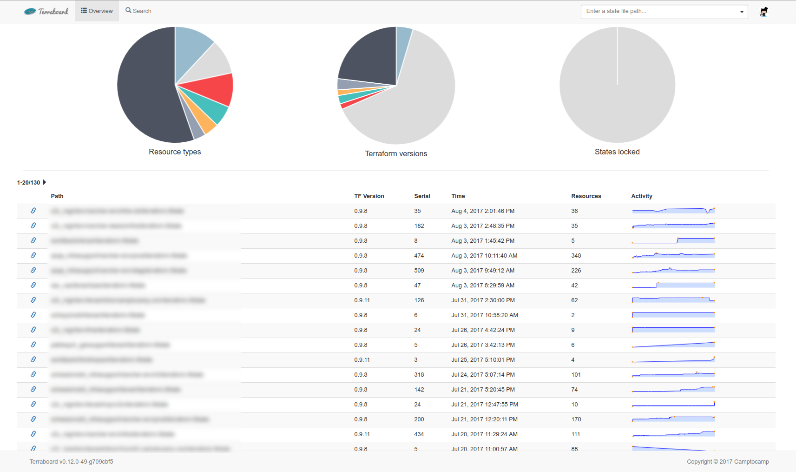
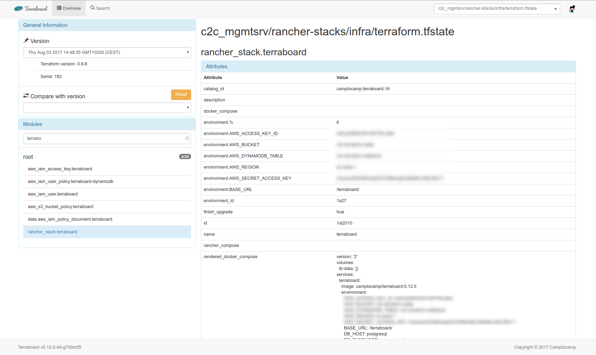
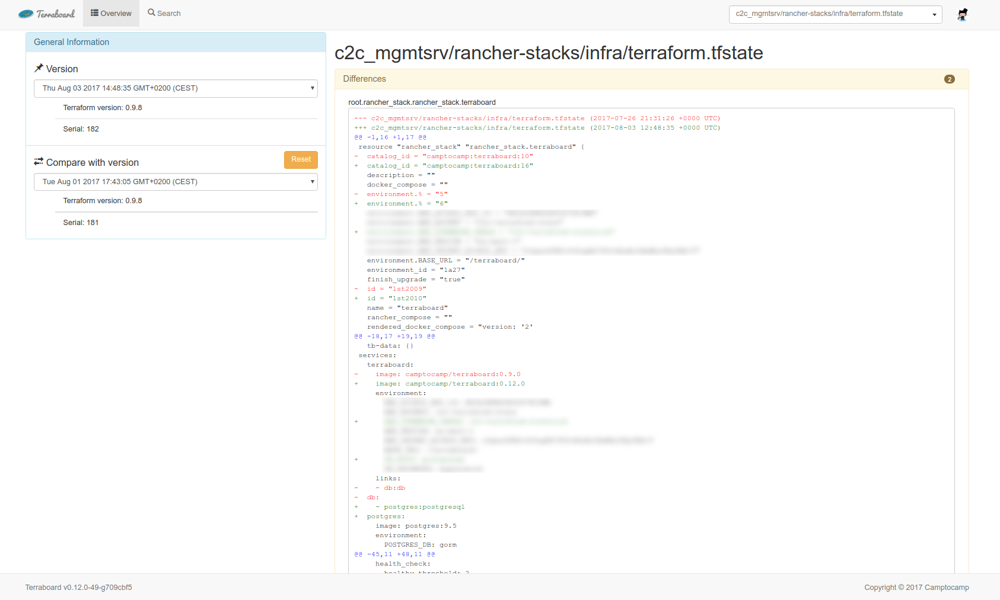
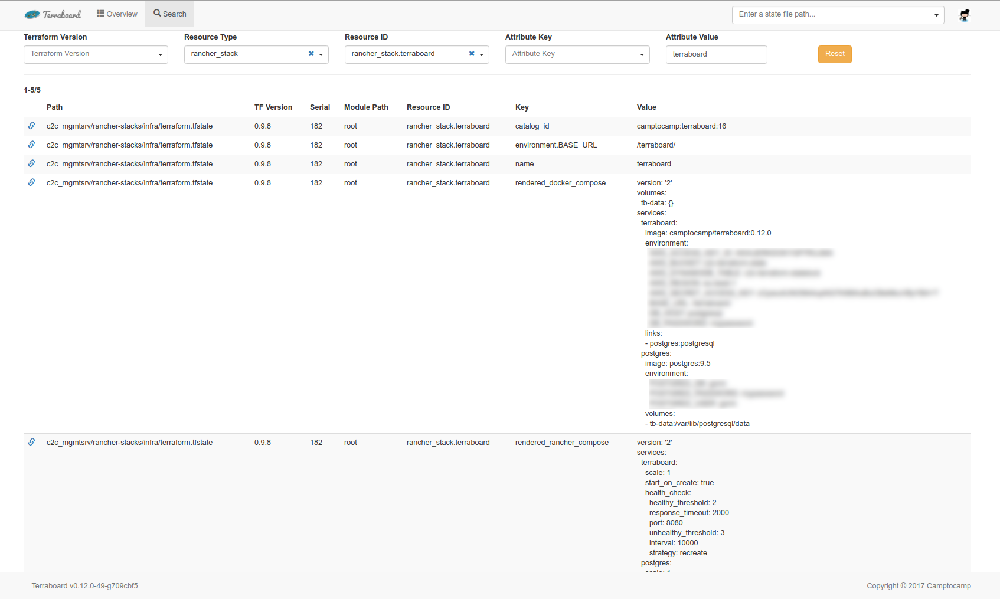

!SLIDE
## Introducing Terraboard

* Web interface for remote state visualization and querying
* Written in Go + AngularJS
* Supports S3 remote + DynamoDB table
* Uses PostgreSQL as a database

!SLIDE
## Main view

* lists all states in the bucket
* displays stats

!SLIDE
## State View

* details of a single state
* modules and resources
* access to compare versions

!SLIDE
## Compare View

* compare two versions of a single state
* view diff between resources and resources in only one version

!SLIDE
## Search View

* search for attributes
* filter by Terraform version
* filter by resource type, resource id
* filter by attribute name, attribute value

